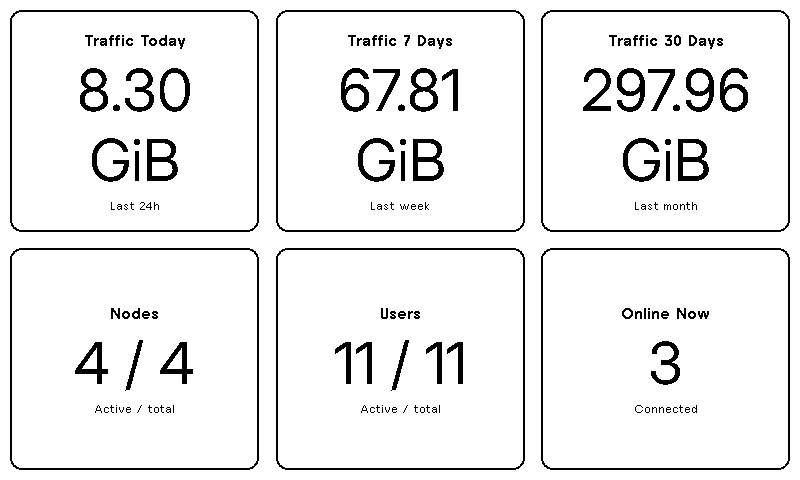

# TRMNL Remnawave Dashboard

A dashboard plugin for [TRMNL](https://trmnl.com/) e-paper displays that shows real-time statistics from your [Remnawave](https://github.com/remnawave/backend) instance.



## Features

Displays key metrics in a clean 3×2 grid:

- **Traffic Today** (Last 24h)
- **Traffic 7 Days** (Last week)
- **Traffic 30 Days** (Last month)
- **Nodes** (Active / Total)
- **Users** (Active / Total)
- **Online Now** (Currently connected users)

## Requirements

- A TRMNL account with the [Developer add-on](https://help.trmnl.com/en/articles/9510536-private-plugins) (or BYOD license)
- A Remnawave instance with an API token (Bearer JWT from the panel)

## Installation

### Option A — `trmnlp push` (recommended)

If you use the local [`trmnlp`](https://github.com/usetrmnl/trmnlp) CLI:

```bash
trmnlp login
trmnlp push
```

Then open the plugin in your TRMNL account and fill in **API URL** and **API Token**.

### Option B — Manual setup in the TRMNL UI

Follow [Private Plugins](https://help.trmnl.com/en/articles/9510536-private-plugins). On the create/edit plugin page, set:

#### 1. Strategy

Choose **Polling**.

#### 2. Polling URL(s)

Paste these three lines (one URL per line):

```text
{{ api_url }}/api/system/stats
{{ api_url }}/api/system/stats/bandwidth
{{ api_url }}/api/nodes
```

#### 3. Polling Verb

Leave as **GET**.

#### 4. Polling Headers

One header per line (`Name: Value` or `name=value`):

```text
Authorization: Bearer {{ api_token }}
Accept: application/json
```

> In `src/settings.yml` (for `trmnlp`) headers are stored as a single `&`-joined string; the TRMNL web UI expects one header per line as shown above.

Leave **Polling Body** empty.

#### 5. Form Fields

Paste this YAML into **Form Fields** (see [custom form builder](https://help.trmnl.com/en/articles/10513740-custom-plugin-form-builder)):

```yaml
- keyname: author_bio
  field_type: author_bio
  name: Author Bio
  description: >-
    Remnawave panel stats for TRMNL (traffic, nodes, users, online).<br/><br/>
    Author: <a href="https://github.com/ZolanPro">ZolanPro</a><br/>
    Repo: <a href="https://github.com/ZolanPro/trmnl-remnawave">trmnl-remnawave</a><br/>
    Email: <a href="mailto:ZolanPro@gmail.com">ZolanPro@gmail.com</a><br/><br/>
    Setup: create an API token in your Remnawave dashboard, then set API URL
    (e.g. https://your-panel.example.com) and API Token below. Leave Polling Body empty.

- keyname: categories
  field_type: select
  name: Category
  options:
    - analytics
  default: analytics

- keyname: api_url
  field_type: text
  name: API URL
  description: Base URL of your Remnawave instance (no trailing slash)
  placeholder: https://vpn.example.com
  help_text: Example — https://vpn.example.com

- keyname: api_token
  field_type: password
  name: API Token
  description: Bearer JWT from Remnawave (API tokens / panel settings)
  help_text: Paste the token only — the Authorization header is added automatically
```

#### 6. Other options

| Field | Value |
| --- | --- |
| Remove bleed margin? | **No** |
| Enable Dark Mode? | **No** |
| Enable OAuth Authentication? | leave disabled |

Save the plugin.

#### 7. Markup

Click **Edit Markup**, then paste:

| File | Tab |
| --- | --- |
| `src/full.liquid` | **Full** |
| `src/half_horizontal.liquid` | **Half Horizontal** |
| `src/half_vertical.liquid` | **Half Vertical** |
| `src/quadrant.liquid` | **Quadrant** |
| `src/shared.liquid` | **Shared** |

The templates read the three poll responses as `IDX_0` (stats), `IDX_1` (bandwidth), and `IDX_2` (nodes) — no serverless transform required. Shared holds common CSS for metric cards.

#### 8. Finish

1. Open the plugin settings and enter your **API URL** and **API Token**
2. Click **Force Refresh** to fetch data
3. Check the Markup editor **Your variables** / live preview

## Development

```bash
# Local preview (Docker)
docker compose up -d
# → http://localhost:4567

# Or CLI
trmnlp serve
```

Create `.trmnlp.yml` in the project root (this file is gitignored):

```yaml
custom_fields:
  api_url: "https://your-remnawave-instance.com"
  api_token: "your_bearer_token_here"

watch:
  - src
  - .trmnlp.yml
```

Click **Poll** in the local previewer to refresh data from Remnawave.

## Project layout

| Path | Purpose |
| --- | --- |
| `src/settings.yml` | Plugin config (strategy, polling, form fields) |
| `src/full.liquid` | Full-screen markup |
| `src/half_horizontal.liquid` | Half horizontal mashup |
| `src/half_vertical.liquid` | Half vertical mashup |
| `src/quadrant.liquid` | Quadrant mashup |
| `src/shared.liquid` | Shared CSS and node helpers for all sizes |
| `icon.svg` | Plugin icon (512×512) |
| `docs/preview.png` | README preview image |
| `LICENSE` | CC-BY 4.0 + TRMNL Plugin Licensing |
| `.trmnlp.yml` | Local secrets / preview config (not committed) |

## License

[CC-BY 4.0](https://creativecommons.org/licenses/by/4.0/) (visual design, data parsing, and markup), plus [TRMNL Plugin Licensing](https://github.com/usetrmnl/plugin-license) terms for Recipe publication. See [LICENSE](LICENSE).
